# NpmRatPoison

Incident-response tooling for npm supply-chain hot items, with local triage, remote GitHub scanning, structured reporting, a .NET 10 Blazor operations dashboard, and a provider-facing RSA-secured ingestion API for patches, advisories, and indicator bundles.

## What It Does

- Scans local repositories for known malicious dependency patterns.
- Quarantines compromised lockfiles instead of patching them in place.
- Supports remote GitHub manifest/lockfile/history scans without cloning.
- Emits JSON, CSV, and HTML reports.
- Provides severity-based exit codes for automation.
- Hosts a Blazor dashboard for operators and responders.
- Accepts external provider advisories, patches, and diffs through a database-backed ingestion API.

## Code Flow

```mermaid
flowchart LR
    Provider[Threat / Patch Provider]
    Keygen[CLI RSA Credential Generator]
    PrivateKey[Provider Private Key]
    PublicKey[(Provider API Key Store)]
    Gateway[/Provider Ingress API/]
    RateLimit[Rate Limiter]
    Verify[RSA-PSS Signature Validation]
    Validate[Document Schema + Provider Policy Validation]
    Replay[VapeCache Replay / Duplicate Guard]
    Store[(Ingress Database<br/>PostgreSQL in production)]
    Scanner[Catalog + Cleanup Services]
    Reports[JSON / CSV / HTML Reports]
    UI[Blazor Operations Dashboard]

    Keygen -->|stores public key| PublicKey
    Keygen -->|exports private key once| PrivateKey
    Provider -->|signed JSON + api key id| Gateway
    PrivateKey --> Provider
    Gateway --> RateLimit --> Verify --> Validate --> Replay --> Store
    Store --> Scanner --> Reports --> UI
    Scanner --> UI
```



## Provider Ingress

The provider ingress surface is designed for external patch/vulnerability feeds and daemon or Windows Service hosting.

- Authentication: `RSA-PSS-SHA256`
- Required headers:
  - `X-NpmRatPoison-Api-Key`
  - `X-NpmRatPoison-Provider`
  - `X-NpmRatPoison-Timestamp`
  - `X-NpmRatPoison-Signature`
- Schema discovery endpoint: `/api/provider-ingress/v1/schema`
- Contract discovery endpoint: `/api/provider-ingress/v1`
- Submission endpoint: `/api/provider-ingress/v1/submissions`

The API key is an identifier for a database-backed RSA credential. The private key never lives on the server; only the public key is stored.

## Datastore

Production ingress storage is intended for PostgreSQL. Incoming provider documents are stored in the relational database rather than flat JSON inbox files, with duplicate protection and indexed metadata for later triage and reporting.

SQLite is still supported by Microsoft and EF Core, but in this project it is now treated as a lightweight dev/test option rather than the primary provider-facing store.

## Run Modes

CLI examples:

```powershell
dotnet run --project .\NpmRatPoison\NpmRatPoison.csproj -- --help
dotnet run --project .\NpmRatPoison\NpmRatPoison.csproj -- --version
dotnet run --project .\NpmRatPoison\NpmRatPoison.csproj -- --apply-provider-ingress-migrations
dotnet run --project .\NpmRatPoison\NpmRatPoison.csproj -- --path . --dry-run
dotnet run --project .\NpmRatPoison\NpmRatPoison.csproj -- --all-drives --include-non-github
dotnet run --project .\NpmRatPoison\NpmRatPoison.csproj -- --remote-github-scan --remote-github-repo owner/name
dotnet run --project .\NpmRatPoison\NpmRatPoison.csproj -- --generate-provider-api-key --provider-id demo-provider
```

Dashboard / service host:

```powershell
dotnet run --project .\NpmRatPoison\NpmRatPoison.csproj -- --ui --service --urls http://127.0.0.1:5100
```

## Local Dev with SQLite

For local smoke testing without PostgreSQL:

```powershell
$env:ProviderIngress__DatabaseProvider = 'sqlite'
$env:ConnectionStrings__ProviderIngress = 'Data Source=.\artifacts\provider-ingress\provider-ingress.db;Pooling=False'
dotnet run --project .\NpmRatPoison\NpmRatPoison.csproj -- --ui --service
```

## Production with PostgreSQL

Use a real PostgreSQL connection string via configuration or environment override:

```powershell
$env:ConnectionStrings__ProviderIngress = 'Host=postgres.example;Port=5432;Database=npmratpoison;Username=npmratpoison;Password=<secret>'
dotnet run --project .\NpmRatPoison\NpmRatPoison.csproj -- --service
```

Apply schema changes before first public ingress use:

```powershell
dotnet run --project .\NpmRatPoison\NpmRatPoison.csproj -- --apply-provider-ingress-migrations
```

## Deployment

Windows Service publish:

```powershell
dotnet publish .\NpmRatPoison\NpmRatPoison.csproj /p:PublishProfile=WindowsService
```

Service install helper:

```powershell
.\deploy\windows-service\Install-NpmRatPoisonService.ps1 `
  -PublishRoot .\artifacts\publish\windows-service `
  -ProviderIngressConnectionString 'Host=postgres.example;Port=5432;Database=npmratpoison;Username=npmratpoison;Password=<secret>' `
  -ApplyProviderIngressMigrations `
  -StartService
```

## Key Safety Defaults

- Host remediation is off by default. Use `--host-remediation` only when you intend to clean shell profiles and host artifacts.
- Lockfiles are quarantined and must be regenerated from a trusted registry.
- Threat catalogs can be validated with `--catalog-sha256`.
- Provider ingress documents are duplicate-guarded and rate-limited before they hit storage.
- RSA provider private keys are emitted only once at generation time.

## Exit Codes

- `0` clean run / no actionable findings
- `10` informational findings
- `20` warnings
- `30` critical findings
- `40` execution errors
- `2` invalid arguments or failed catalog validation

## Reports

Reports are written as:

- `.json` for automation
- `.csv` for SOC/export workflows
- `.html` for operator handoff

The dashboard writes to `./artifacts/dashboard-reports`.

## Delivery

- CI/release workflow: [.github/workflows/ci-release.yml](c:/Visual%20Studio%20Projects/NpmRatPoison/.github/workflows/ci-release.yml)
- Operator runbook: [docs/operator-runbook.md](c:/Visual%20Studio%20Projects/NpmRatPoison/docs/operator-runbook.md)
- Windows Service deployment: [docs/windows-service-deployment.md](c:/Visual%20Studio%20Projects/NpmRatPoison/docs/windows-service-deployment.md)
- Catalog governance: [docs/catalog-governance.md](c:/Visual%20Studio%20Projects/NpmRatPoison/docs/catalog-governance.md)
